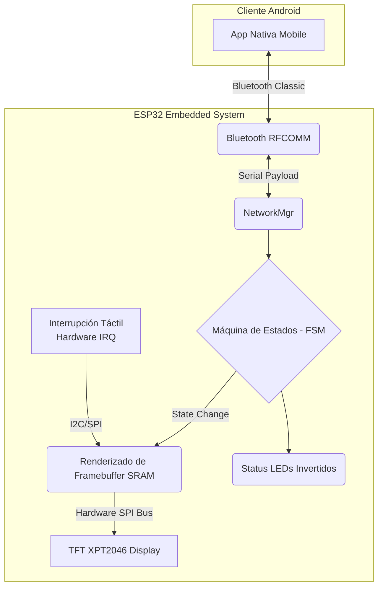

# 🕹️ Tamagotchi IoT: Un Caso de Estudio en Arquitectura Embebida (ESP32)

> Cruce entre la nostalgia de los 90s y la severidad de la ingeniería embebida.

Si creciste en los 90s, el Tamagotchi era magia. Si has crecido en la ingeniería de software, descubres que la verdadera magia ocurre cuando logras meter una Máquina de Estados, renderizado gráfico asíncrono y una red Bluetooth dentro de un chip con apenas 520 KB de RAM, y logras que todo funcione a la velocidad de la luz.

Este no es "un proyecto más". Es un **Caso de Estudio End-to-End** (Hardware Firmware + Aplicación Nativa Android) diseñado para desafiar los cuellos de botella térmicos, de memoria y de latencia del microcontrolador ESP32.

---

## 🏗️ La Arquitectura (El Vuelo de Pájaro)

Todo gran sistema escalable requiere un contrato estricto de funcionamiento para no romperse. El Firmware (C++) y el Cliente Android intercambian datos en tiempo real bajo esta topología:

---

## 📚 Entendiendo el Porqué (decisiones de diseño)

No basta con que el código funcione; **hay que saber *por qué* funciona y qué hay que sacrificar para lograrlo**. 

Las decisiones que tomaron una mascota virtual lenta y la volvieron un dispositivo intensamente veloz y responsivo están explicadas como artículos:

### 1. 🧠 [La Lógica: Adiós al Código Espagueti](docs/logica_maquina_estados.md)
¿Cómo programas a un ser que sufre hambre, duerme, puede interactuar y morir... sin escribir un abismo de `if/else`? Todo el núcleo vital no interactúa con la UI, sino que opera bajo una estructura asíncrona mediante la **Arquitectura FSM (Finite State Machine)**.

### 2. 🔌 [La Memoria: El Truco de la Pantalla](docs/optimizacion_hardware_sram.md)
Obligar a una placa de desarrollo económica a repintar toda una pantalla pixel por pixel causa un parpadeo visual tremendo. Aquí explico el concepto de  **"Secuestro de SRAM"** (Técnica de *Framebuffer* acelerada por SPI físico) que aplicó "esteroides" a la pantalla.

### 3. 📡 [La Red: JSON vs Bytes Puros en IoT](docs/protocolo_bluetooth_spp.md)
El uso de texto largo y librerías modernas como JSON bloquean brutalmente el "Event-Loop" de chips pequeños. Esta lectura muestra por qué usar un payload de **1 solo Byte** salvó la latencia y revela cómo inyectar un mecanismo *"Backdoor"* o Modo Trampa de QA para automatizar testing de estrés logrando telemetría instantánea.

---

## 🔮 Evolución (Roadmap a v2.0)

Con la vista puesta la escalabilidad industrial a futuro, mi siguiente paso natural para este desarrollo es:
1. **Modo Híbrido "Deep Sleep":** Convertir el estado *Dormido* de la mascota en un apagado extremo funcional del CPU (`ESP.deepSleep()`). La magia consistirá en usar el cable de la alarma física de la pantalla táctil (`XPT2046_IRQ`) como detonador por descarga (Wake-Up Device) para que el ESP despierte al toque de un dedo, extendiendo meses la vida útil para producción masiva.

---
*«La verdadera perfección puede parecer primitiva, pero su utilidad es inagotable.» — Lao Tse*
