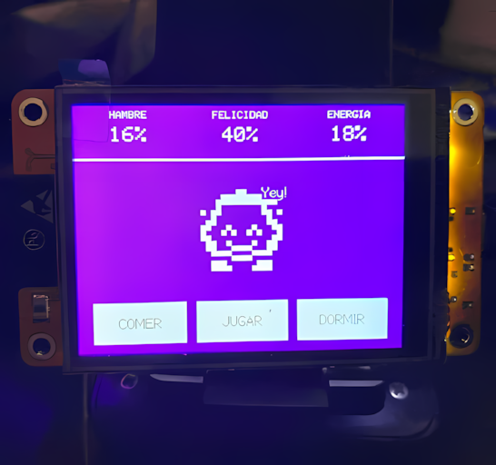
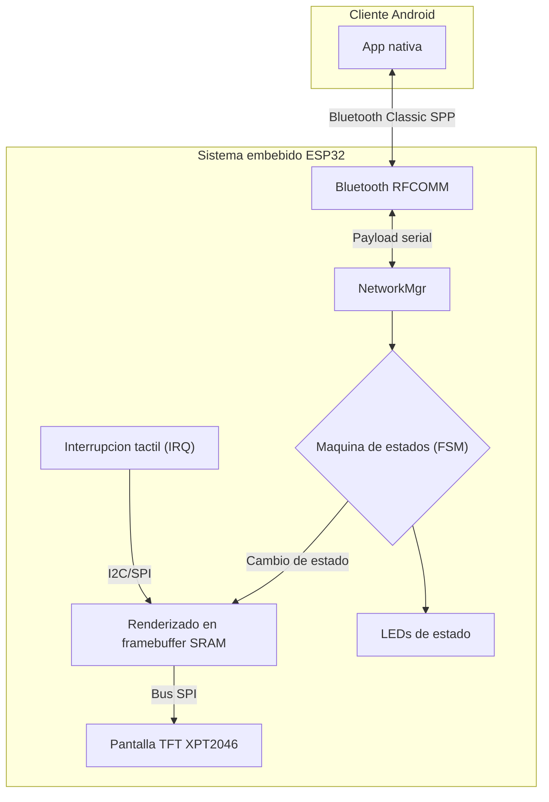

# Tamagotchi IoT (ESP32 + Android)

Proyecto educativo y de portafolio que integra firmware embebido en ESP32 con una app nativa Android para controlar una mascota virtual en tiempo real por Bluetooth Classic (SPP), con manejo de permisos segun version de Android para mejorar compatibilidad entre equipos antiguos y modernos.

## Que problema resuelve

Este proyecto demuestra como disenar una arquitectura IoT funcional cuando el hardware tiene recursos limitados (RAM, CPU y ancho de banda), evitando bloqueos en UI y manteniendo interaccion fluida.

## Para quien esta pensado

- Estudiantes que quieren aprender integracion real entre firmware y app movil.
- Desarrolladores que quieren practicar arquitectura embebida con ESP32.
- Equipos docentes o tecnicos que necesitan un ejemplo end-to-end reproducible.

## Resultados tecnicos del enfoque

- Control remoto de estados del Tamagotchi por Bluetooth Classic (SPP).
- Logica desacoplada mediante FSM (Finite State Machine).
- Protocolo de comandos de 1 byte para minimizar latencia.
- Modo de pruebas (cheat mode) para QA rapido sin esperar ciclos largos.

## Arquitectura general

## Estructura del repositorio

- `Tamagotchi_sketch/`: firmware para ESP32 (Arduino).
  - Archivo principal: `Tamagotchi_sketch/Tamagotchi_sketch.ino`
  - Modulos clave: `Tamagotchi.cpp`, `NetworkMgr.cpp`
- `TamagotchiIoT/`: proyecto Android Studio.
  - App module: `TamagotchiIoT/app/`
  - Entrada principal: `MainActivity.java`
- `docs/`: documentacion de decisiones tecnicas.

## Requisitos

- ESP32
- Pantalla TFT compatible con controlador XPT2046 (segun tu cableado)
- Arduino IDE (o entorno compatible)
- Android Studio
- Telefono Android con Bluetooth

## Guia rapida (uso de los 2 proyectos)

1. **Cargar firmware en ESP32**
- Abre `Tamagotchi_sketch/Tamagotchi_sketch.ino` en Arduino IDE.
- Selecciona tu placa ESP32 y puerto serie.
- Compila y sube el firmware.

2. **Abrir app Android**
- Abre la carpeta `TamagotchiIoT/` en Android Studio.
- Sincroniza Gradle y ejecuta la app en dispositivo fisico.

3. **Emparejar y conectar**
- Empareja el telefono con el ESP32 por Bluetooth.
- Desde la app, conecta al dispositivo y envia comandos.
- La app aplica manejo de permisos por version de Android (Android 12+ vs versiones anteriores).

4. **Comandos de control (protocolo simple)**
- `F`: alimentar
- `P`: jugar
- `S`: dormir

5. **Pruebas con cheat mode (QA)**
- Envia por serial una trama con formato:
- `#<hambre>,<felicidad>,<energia>\n`
- Ejemplo: `#5,100,50`

## Decisiones de ingenieria documentadas

- [Diseno de la maquina de estados](docs/logica_maquina_estados.md)
- [Optimizacion de memoria y framebuffer](docs/optimizacion_hardware_sram.md)
- [Protocolo Bluetooth SPP y contrato de datos](docs/protocolo_bluetooth_spp.md)

## Roadmap

- Modo de bajo consumo con `deepSleep` y wake-up por interrupcion tactil.
- Mejoras de telemetria para medir latencia de comandos y ciclos de estado.

## Nota

Este repositorio esta enfocado en aprendizaje aplicado y documentacion tecnica. La idea es que puedas modificar firmware y app para crear tu propia variante del Tamagotchi IoT.
