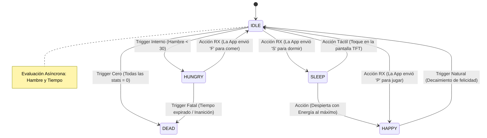

# 🧠 Diseño de la Máquina de Estados (FSM)

Como estaba empezando en IoT, fue inevitable que mi primer proyecto terminara lleno de una montaña inmanejable de condicionales `if / else`. *"Si tiene hambre, haz esto; si además está durmiendo, no lo animes; pero si presiona el botón, despiértalo"*. En poco tiempo, el código se vuelve ilegible y difícil de depurar.
Entonces decidí probar algo más práctico. La lógica vital de la mascota **no está atada a los botones físicos de la pantalla**. Todo el flujo de toma de decisiones está centralizado en un Motor de Estados independiente y se ejecuta de manera asíncrona en el Backend del dispositivo (`Tamagotchi.cpp`).
Aquí te explico cómo una **Máquina de Estados Finita (FSM)** aisló el caos.

## El Ciclo de Vida ("Core Evaluator")

En lugar de preguntar constantemente *"¿Qué comando llegó por Bluetooth?"*, el subproceso central evalúa exclusivamente en qué **Estado Actual** se encuentra la mascota. Desde ahí, el sistema determina si debe saltar al siguiente estado provocado por una orden del jugador (`I/O Triggers`) o simplemente porque los ciclos de reloj pasaron y el personaje sufrió un decaimiento biológico simulado (`Time Tick`).

A continuación, he abstraído la topología mental del Tamagotchi:

## "Prioridad Cero": La Muerte no perdona

No importa en qué estado exótico del código se encuentre el ESP32, ni si la app de Android está enviando repetidamente comandos para alimentar a la mascota. Existe una condición por encima de todo: **Si el umbral de supervivencia decae a `0.0f` por degradación simultánea, el juego ha terminado.**

*   Ambos procesos principales del chip (el de red magnética y el bucle de tiempo) detectan esta rama subyacente y se acoplan de forma estricta y permanente al estado inmutable `DEAD`.
*   Al entrar en `DEAD`, el sistema apaga el "listener" (puerto de escucha) de Bluetooth para no recibir más comandos fantasma, congela el búfer de la pantalla proyectando la "lápida" final, y da por clausurada la abstracción ahorrando ciclos de energía valiosos.

La única forma viable de revivir a tu mascota es mediante el "Cheat Mode" (Modo Trampa) basta con modificar los valores de las variables de estado para que la mascota vuelva a la vida, sana y feliz :).